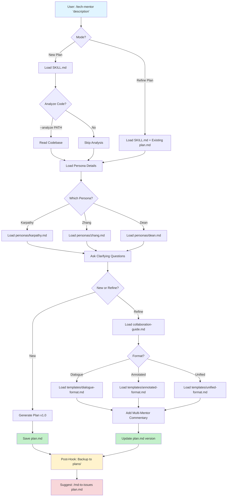

# Tech Mentor Skill

A Claude Code skill that generates technical planning documents through mentorship-style conversations. Uses expert personas to break down complex projects into clear, actionable plans with pedagogical explanations of design decisions.

## Overview

The tech-mentor skill acts as your technical mentor, helping you plan software projects through conversation and code analysis. It generates detailed planning documents that explain the "why" behind technical decisions, not just the "what."

### Available Mentors

- **Andrej Karpathy** (default) - Deep Learning & ML expert
- **Eric Zhang** - Systems & Human-Computer Interaction expert
- **Jeff Dean** - Large-scale infrastructure & performance expert
- **Fernanda Viégas & Martin Wattenberg** - AI interpretability & visualization experts

### Key Features

- 🎯 Single-mentor plans or multi-mentor collaboration
- 📊 Three collaboration formats (dialogue, annotated, unified)
- 🔄 Automatic plan versioning and backup
- 🧠 Pedagogical explanations with trade-offs and best practices
- 📁 Progressive disclosure - loads details only when needed
- 🔗 Integrates with `md-to-issues` and `gitlab-issue-creator`

## Workflow



## Quick Start

### Create a New Plan (Single Mentor)

```bash
# ML/DL project with default Karpathy persona
/tech-mentor "Build a GPT-2 model from scratch for learning"

# Systems design with Zhang persona
/tech-mentor --persona "Eric Zhang" "Design a real-time collaborative editor"

# Scale analysis with Dean persona
/tech-mentor --persona "Jeff Dean" "Design a distributed caching layer for 1M QPS"

# Analyze existing code first
/tech-mentor --analyze src/models/ "Add RLHF fine-tuning pipeline"
```

### Multi-Mentor Collaboration

```bash
# Step 1: Create initial ML plan
/tech-mentor "Build propensity model with uncertainty quantification"
# → Creates plan.md v1.0 (Karpathy perspective)

# Step 2: Add systems/UX perspective
/tech-mentor --persona "Eric Zhang" --refine plan.md --format dialogue \
  "Review from systems and interaction design perspective"
# → Updates to plan.md v2.0 with dialogue between Karpathy and Zhang

# Step 3: Add scale analysis on specific component
/tech-mentor --persona "Jeff Dean" --refine plan.md \
  --comment-on "Batch Prediction Pipeline" \
  "Analyze implications at 100x scale"
# → Updates to plan.md v2.5 with focused Dean commentary
```

## Directory Structure

```
tech-mentor/
├── README.md                         # This file
├── SKILL.md                          # Main skill entry point
├── collaboration-guide.md            # Multi-mentor patterns & workflows
├── personas/
│   ├── karpathy.md                  # Andrej Karpathy detailed guide
│   ├── zhang.md                     # Eric Zhang detailed guide
│   ├── dean.md                      # Jeff Dean detailed guide
│   └── viegas-wattenberg.md         # Viégas & Wattenberg detailed guide
└── templates/
    ├── dialogue-format.md           # Conversation-style format
    ├── annotated-format.md          # Inline attribution format
    └── unified-format.md            # Synthesized narrative format
```

### Progressive Disclosure

Files are loaded on-demand to minimize token usage:

- **Always loaded**: SKILL.md (385 lines)
- **Loaded when refining**: Existing plan.md via dynamic injection
- **Loaded as needed**: Persona files (~1000 tokens each)
- **Loaded for refinements**: collaboration-guide.md (~1500 tokens)
- **Loaded by format**: Template files (~2000 tokens each)

**Result**: 60-70% fewer tokens than loading everything upfront!

## Output Formats

### Single-Mentor Plan

Creates a structured plan document with:
- Context & Motivation (the "why")
- Technical Approach with design decisions
- Components with detailed rationale
- Common pitfalls and best practices
- Trade-offs explained
- Success criteria
- Minimal starting point

### Multi-Mentor Formats

**Dialogue Format**: Conversation threads between mentors
```markdown
**[Karpathy - v1.0]:** Use quantile regression for uncertainty...
**[Zhang - v2.0, → Karpathy on quantile regression]:** Technically sound, but consider UX implications...
**[Dean - v2.5, → storage optimization]:** Let's do the math at 100x scale...
```

**Annotated Format**: Component-based with inline mentor sections
```markdown
## Component Name
**[Karpathy - v1.0]** Original design...
**[Zhang - v2.0, building on Karpathy]** Systems perspective...
**[Dean - v2.5]** Scale implications...
```

**Unified Format**: Synthesized coherent narrative
```markdown
## Component Name
[Integrated description]
*From ML perspective:* ...
*From systems perspective:* ...
*At scale:* ...
```

## Integration with Workflow

The tech-mentor skill is the first step in a complete planning-to-execution workflow:

```
1. /tech-mentor → plan.md (mentorship + planning)
2. /md-to-issues → issues.json (decompose into atomic tasks)
3. /gitlab-issue-creator → GitLab (create issues)
```

## Arguments Reference

```bash
/tech-mentor [OPTIONS] "description"
```

**Options:**
- `--persona NAME` - Choose mentor: "Andrej Karpathy" (default), "Eric Zhang", "Jeff Dean", "Viégas & Wattenberg"
- `--analyze PATH` - Analyze codebase at path before planning
- `--refine FILE` - Build upon existing plan (enables multi-mentor mode)
- `--format FORMAT` - Output format: `unified` (default), `dialogue`, `annotated`
- `--comment-on SECTION` - Focus refinement on specific section(s), comma-separated

## Examples

### ML/DL Projects (Karpathy)

```bash
# Simple request
/tech-mentor "Train a small GPT from scratch"

# With code analysis
/tech-mentor --analyze src/models/ "Add mixture of experts to transformer"

# With constraints
/tech-mentor "Build an image classifier with limited GPU budget"
```

### Systems Design (Zhang)

```bash
# Systems project
/tech-mentor --persona "Eric Zhang" "Build a distributed task queue"

# With UX focus
/tech-mentor --persona "Eric Zhang" \
  "Redesign the admin dashboard for better usability"

# Analyzing existing system
/tech-mentor --persona "Eric Zhang" --analyze src/api/ \
  "Improve API error handling for better developer experience"
```

### Scale Analysis (Dean)

```bash
# Performance analysis
/tech-mentor --persona "Jeff Dean" "Scale our ML inference to 1M QPS"

# Cost optimization
/tech-mentor --persona "Jeff Dean" --analyze infra/ \
  "Reduce infrastructure costs while maintaining SLAs"

# Multi-region design
/tech-mentor --persona "Jeff Dean" \
  "Design a multi-region deployment strategy for 99.99% uptime"
```

## Automatic Features

### Plan Versioning & Backup

Every time the skill runs, it automatically:
1. Backs up existing `plan.md` to `plans/plan-backup-TIMESTAMP.md`
2. Updates the version number in metadata
3. Tracks which mentors contributed and when

### Dynamic Context Injection

If `plan.md` exists, it's automatically loaded into context when using `--refine`. No need to manually read the file.

### Metadata Tracking

Plans include structured metadata:
```yaml
---
title: Project Name
mentors:
  - name: Andrej Karpathy
    iterations: [1.0]
    focus: ML architecture
    date: 2026-03-13
  - name: Eric Zhang
    iterations: [2.0]
    focus: Systems/UX
    date: 2026-03-13
version: 2.0
last_updated: 2026-03-13
---
```

## Tips for Best Results

**Do:**
- ✅ Be specific about what you want to build
- ✅ Mention constraints (time, resources, team skills)
- ✅ Share existing code with `--analyze` if relevant
- ✅ Ask follow-up questions during the mentoring conversation
- ✅ Use `--comment-on` to focus refinement on specific sections

**Don't:**
- ❌ Rush through the conversation
- ❌ Skip the "why" - understanding matters
- ❌ Ignore the mentor's clarifying questions
- ❌ Expect one-size-fits-all solutions

**For Multi-Mentor Collaboration:**
- Start with one mentor's complete plan (v1.0)
- Add subsequent mentors to refine, not rewrite
- Choose format based on goal:
  - **Dialogue**: Design debates, conflicting approaches
  - **Annotated**: Complementary independent insights
  - **Unified**: Final cohesive documentation

## Persona Selection Guide

| Project Type | Recommended Persona | Why |
|-------------|-------------------|-----|
| Neural networks, LLMs, computer vision | Andrej Karpathy | Deep learning expertise, pedagogical approach |
| Distributed systems, databases, caching | Jeff Dean | Large-scale systems, performance optimization |
| User-facing applications, APIs, dashboards | Eric Zhang | Systems + UX, operational simplicity |
| Model interpretability, explainability | Viégas & Wattenberg | Mechanistic interpretability, visualization |
| Data visualization, visual analytics | Viégas & Wattenberg | Information design, interactive exploration |
| Creative AI, generative art | Viégas & Wattenberg | Artistic exploration, human-AI collaboration |
| Training infrastructure, MLOps | Karpathy + Dean | ML expertise + scale considerations |
| Real-time collaboration, interactive systems | Zhang + Dean | UX + performance requirements |
| Production ML with monitoring | Karpathy + Viégas & Wattenberg | Model development + interpretability |
| Production ML systems | All four | ML → Systems → Scale → Interpretability |

## Contributing to the Skill

The skill follows [Agent Skills best practices](https://platform.claude.com/docs/en/agents-and-tools/agent-skills/best-practices):

- SKILL.md kept under 500 lines (currently 385)
- Progressive disclosure with separate reference files
- Workflow checklists for complex tasks
- Third-person description for proper discovery
- One-level-deep file references
- Dynamic context injection for efficiency

## License

Part of the Claude Code skills ecosystem.

## Related Skills

- **md-to-issues**: Decompose plans into atomic GitLab issues
- **gitlab-issue-creator**: Create issues from JSON in GitLab
- **simplify**: Review and optimize code quality
